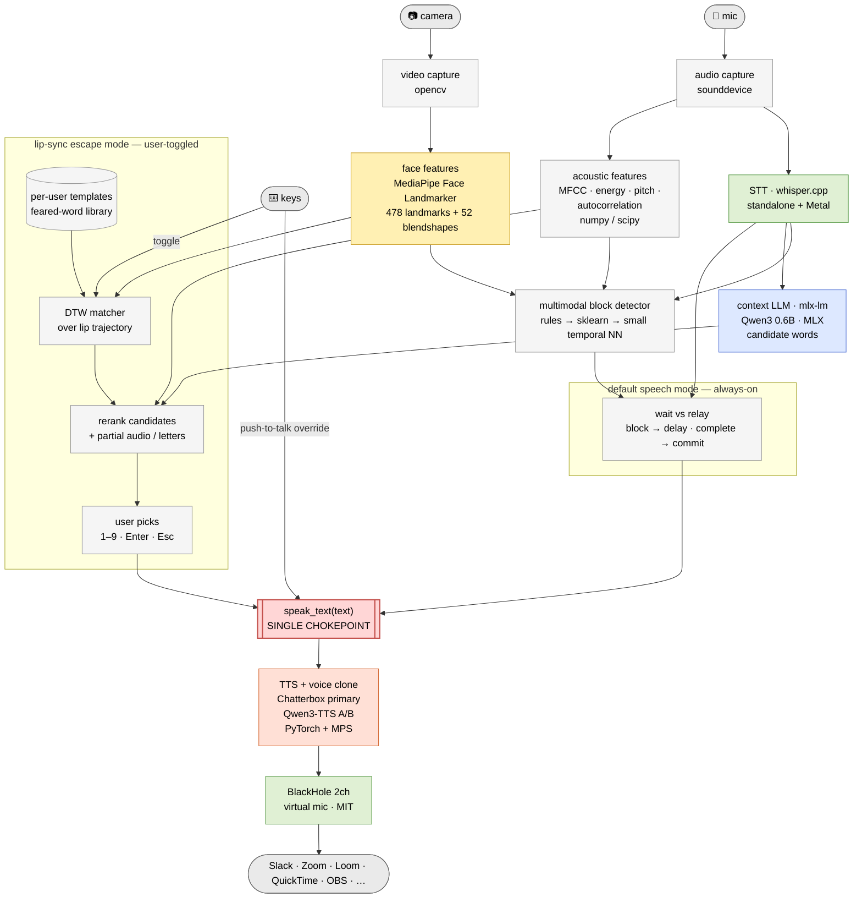

# OpenStutter

> Always free, open-source speech assistance for people who stutter.
> Speak as you normally do or adapt to lip sync for hard to
> say words. Eventually your voices will be relayed fluent.
> The other persons on the call would always receive clear
> and fluent speech.

**macOS · Apple Silicon · local-first · per-user · AGPL-3.0**

> ⚠️ **Status: design phase.** No production code yet.

OpenStutter takes whatever speech signal you can produce — fluent words, disfluent words,
partial sounds, or *silently lip-synced* words — and delivers fluent speech in your **own
cloned voice** through a virtual microphone, so any app (Slack, Zoom, Loom, QuickTime…)
receives clean audio. Everything runs on-device.

# Motivation

I, the author of OpenStutter is a person with stutter since childhood. I've faced several
setbacks in my professional life due to my stuttering problem. It feels so bad when your
teammates look away during a standup and an interviewer rejects you just because you don't
speak fluently. People don't take your ideas very seriously maybe because its hard to focus
on something when the speech has too many hiccups.
This is my attempt to build an AI that can help ease speaking over video calls. This is going
to be an always free software for people who stutter. I'm willing to personally set things up
for my friends at communities like */r/Stutter*.
I will be giving an update on the progress very soon.

## Pipeline / flow

### Runtime / library legend

| Color     | Runtime / library                           | Used for                                                      |
| --------- | ------------------------------------------- | ------------------------------------------------------------- |
| 🟦 blue   | **MLX** (Apple Silicon native)              | Context LLM (`mlx-lm` · Qwen3 0.6B)                           |
| 🟧 orange | **PyTorch + MPS**                           | TTS + voice clone (Chatterbox primary · Qwen3-TTS A/B)        |
| 🟩 green  | **Standalone C/C++ + Metal**                | whisper.cpp (STT) · BlackHole (virtual mic)                   |
| 🟨 yellow | **MediaPipe** (own runtime)                 | Face Landmarker — 478 landmarks + 52 blendshapes              |
| ⬜ grey    | **Python** (numpy / scipy / sklearn / glue) | DSP features · block classifier · DTW matcher · orchestration |
| 🔴 border | `**speak_text(text)` chokepoint**           | The single function every committed-text path flows through   |

### Two interaction modes

- **Default speech mode** (always-on, camera required). You speak; whisper.cpp transcribes;
the multimodal block detector (acoustic + vision + linguistic) decides *wait vs relay*.
Block detected → delay. Sentence complete → commit through `speak_text()`.
- **Lip-sync escape mode** (user-toggled, camera required). You deliberately silently mouth
a feared word; DTW matches your lip trajectory against per-user templates; candidates are
reranked by context LLM + any partial audio/letters; you pick (1–9 / Enter); `speak_text()`
speaks it in your cloned voice.
- **Push-to-talk** is *always* available as a manual override **and** as the **camera-free
baseline** for users without a camera.

## Documentation

*Still in works*

## License

[AGPL-3.0](LICENSE).